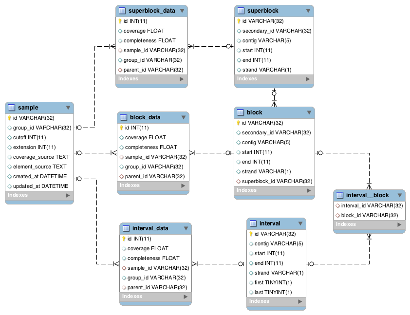

Code walkthrough
================
This guide will discuss design decisions and programming concepts that are used throughout Chanjo.

SQL schema
~~~~~~~~~~
A SQL database is at the core of Chanjo functionality. Elements (exon, transcript, gene) are stored in the database to eventually be annotated. During ``import``, Chanjo makes use of the SQL language to quickly extrapolate coverage annotations onto block and superblock levels. Below is a drawing of the schema for reference.

In the end when all coverage data is loaded in the database, it can be used as an API to query coverage across all elements. It's possible, e.g. to easily calculate average coverage and completeness across all or a subset of elements. More ideas of interesting metrics to compute can be found in the `Chanjo-Report`_ plugin project.

Pipelines
~~~~~~~~~
Data is generally processed internally as `generator pipelines`_. This involves lazy evaluation and always aiming to write linear pipelines that should be pretty straight forward to parallelize.

I've also intentionally designed the command line interface to work well with the awesome UNIX pipes. As far as possible, Chanjo subcommands always provide a default option to read from stdin and write to stdout.

Functional programming
~~~~~~~~~~~~~~~~~~~~~~
I've found that as long as I write code that can easily be unit tested I'm writing good quality code. It's always easier to test a function that only does one thing. These smaller functions can later be combined in a higher layer.

Chanjo makes extensive use of a wonderful Python package called toolz_ that adds a lot of useful utilities to use function programming patterns in Python.

I mainly subscribe the following functional programming concepts:

**Modularize and compose**. Be ruthless and think hard about how you structure your code. Always try to identify patterns of atomic functionality that can be reused, easily switced out, and composed with different atomic components.

**Prefer immutable data structures**. This makes it much easier to make informed statements of how data moves through your program.

**Pure functions**. Functions should never touch any variables outside of their scope + input. Functions can't modify input arguments and cause observable side effects.

.. Design concepts / Conventions
    - Point to SQL structure
    - Coordinate system (1:1)
      - vs. BED
      - Copy previous + update
    - Why it doesn't do more than this? Why not generate a report
  - Motivation
    - vs. BEDTools and PicardTools
    - Clinical sequencing vs. research
  - Dictionary
    - Completeness
  - Development
    - Git branch structure
      - GitHub flow
    - Testing Chanjo
      - py.test
      - travis
    - Building docs

.. _toolz: http://toolz.readthedocs.org/
.. _generator pipelines: http://www.dabeaz.com/generators-uk/index.html
.. _Chanjo-Report: https://github.com/robinandeer/chanjo-report
