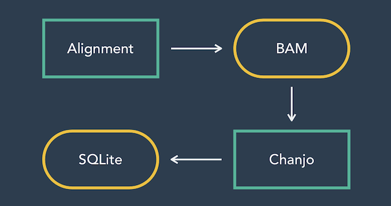

..  _design:

Design concepts
================
In building **Chanjo** I've had to make a few assumptions about it's future use. The following section will set up the premise of why **Chanjo** looks and behaves the way it does. I will explain my reasons and give the reader an overview of how **Chanjo** is architected.

Overview
------------------
**Chanjo** will only ever do three things:

1. set up a sane and powerful datastore of genetic elements + coverage annotations,
2. read coverage depths across a genomic interval,
3. annotate elements with relevant coverage metrics. Everything else is beyond the scope of **Chanjo** and will be provided through additional software.

I believe this will keep **Chanjo** focused and enable any one developer to easily overview all operations at a glance. This promotes maintainability and makes it less of a chore to optimize and continue work on the project.

An example of additional functionality is data analysis of the output from **Chanjo** (SQLite database). Keep in touch for updates on future projects on `my GitHub account <https://github.com/robinandeer>`_.

Motivation
-----------
`BEDtools` and `PicardTools` are both powerful and universally used in DNA sequencing analysis. However, they were built for doing research, not continuous clinic quality checking. This means that simple tasks like finding out coverage for a gene are obscured behind abstract BED intervals. **Chanjo** chooses genes over intervals and handles the rest behind the scenes.

**Chanjo** sets out be part of a new breed of tools aimed at solving problems more or less specific to *clinical* sequencing. **Chanjo** follows a few general guidelines:

1. Interaction should be as intuative as possible.
2. Coverage analysis can't afford to stop at "average coverage".

Use of adapters
------------------
I've spent a lot of time testing different possible combinations how to store data storage and from where to fetch coverage. At one point I was using a binary version of a BED-file called `BigBed`. This allowed for random access of coverage in a moderately compressed format. However, it turned out to be too slow for even whole exome data and I refocused to get coverage directly from the BAM alignment file instead.

The point is that the core of **Chanjo** was able to stay the same in spite of these major changes. I believe the architecture in **Chanjo** makes for a nice separation of concern.

.. note::

  The decision to use adapters was originally inspired by the front end web framework `Ember.js <http://emberjs.com/>`_. It has a number of adapters developed by both first and third party developers to talk to "any" kind of backend server setup.

Coordinate system
------------------
The world of genomics and bioinformatics is in a bit of a pickle. Currently there doesn't exist a defined standard for how to reference genomic positions and intervals.

* BEDTools, extensively used in bioinformatics, uses a 0,1-based coordinate system for genomic intervals. An analogy would be the python `range` function.

* Now go to your favorite genomics database (CCDS, Ensembl). Chances are they work with arguably the most intuitive 1,1-based coordinates.

* Most programming languages use a 0,0-based system, python included.

The need for standardization has become abundantly clear during the development of **Chanjo**. A lot of concepts and tasks become unnecessarily complex when you never quite know how software is implemented or databases are set up.

**Chanjo**'s strict use of 0,0-based coordinates is not to be seen as a proposal for how genomics should work. Instead I simply decided to be as Pythonic as possible. At leasts **Chanjo** is consistent.
