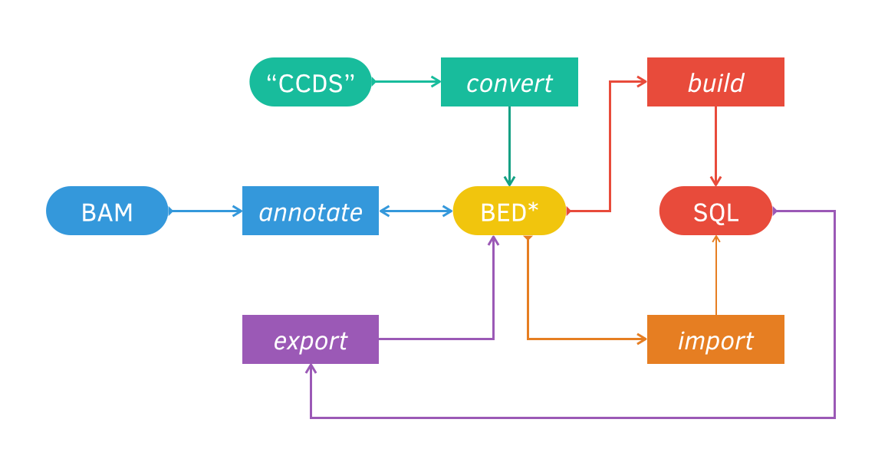
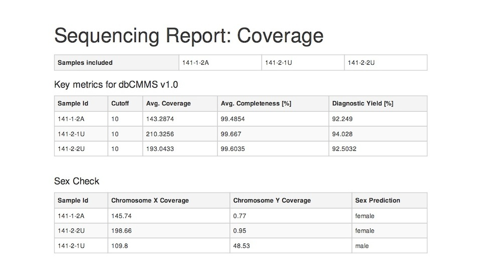

=====================
Introduction & Demo
=====================

Concise overview
-----------------
**Current release**: |codename| (|version|)

Chanjo breaks down coverage to intuitive levels of abstraction; genes, transcripts, exons, and intervals. It also introduces a new coverage metric that reduces the bias from uneven coverage. Chanjo is built around the idea of multiple levels of pipelines and fully embraces bash conventions. It's easily incorporated into existing pipelines and provides a clear path for downstream analysis.

This guide is meant to give an overview of Chanjo, what you can and can't do with it. To start you off, take a look at this flow diagram. It illustrates how the different subcommands from the command line interface relate to each other. Don't worry, you'll learn more about it real soon.

As indicated by the picture, Chanjo is built around streams of data that can be piped around. For example, it's perfectly possible to go from "CCDS" via *convert* and *build* to "SQL". In other commands:

.. code-block:: console

	$ cat CCDS.txt | chanjo convert | chanjo build coverage.sqlite3

Demo
-----
The rest of this document will guide you through a short demo that will cover how to use Chanjo from the command line.

Demo files
~~~~~~~~~~
First we need some files to work with. Chanjo comes with some pre-installed demo files we can use.

.. code-block:: console

	$ chanjo demo chanjo-demo && cd chanjo-demo

This will create a new folder (``chanjo-demo``) in your current directory and fill it with the example files you need.

.. note::
	You can name the new folder anything you like but it *must not already exist*!

Setup and configuration
~~~~~~~~~~~~~~~~~~~~~~~~
Your first task will be to create a config file (``chanjo.toml``). It can be used to store commonly used options to avoid having to type everything on the command line. Chanjo will walk you through setting it up by running:

.. code-block:: console

	$ chanjo init

.. note::
	Chanjo uses project-level config files by default. This means that it will look for a possible ``chanjo.toml`` file in the **current directory** where you execute your commands. You can also point to a diffrent config file using the ``chanjo -c /path/to/chanjo.toml`` option.

If you accepted all defaults, Chanjo will be set up so that it knows e.g. that you want to store your SQL database in the current direcory with the name "coverage.sqlite3".

Defining interesting regions
~~~~~~~~~~~~~~~~~~~~~~~~~~~~~~~
One important thing to note is that Chanjo doesn't consider coverage across the entire genome or exome. Instead you need to define some intervals you are interested in checking the coverage across.

For whole exome sequencing, this could be your targeted regions. Or for clinical sequencing it might be exons from the manually curated CCDS database. In fact the default adapter already converts CCDS transcripts into the BED\* interval file that Chanjo expects.

.. code-block:: console

	$ sort -k1,1 -k2,2n CCDS.mini.txt | chanjo convert > CCDS.mini.bed

.. note::
	The input to ``chanjo convert`` needs to be sorted according to contig/chromosome and start value. You can ensure this easily using the sort command above.

.. note::
	It's perfectly possible to compose your own list of intervals. Just make sure to follow the BED conventions (http://genome.ucsc.edu/FAQ/FAQformat.html#format1).

Initializing a SQL database
~~~~~~~~~~~~~~~~~~~~~~~~~~~~
With the Chanjo formatted BED-file we are ready to build our SQL database that will hold the coverage data for long-term storage. By default Chanjo will setup a SQLite 3 database. Make sure you are using version 3 and not version 2 of SQLite.

.. code-block:: console

	$ chanjo build CCDS.mini.bed

If you prefer to use a MySQL database, the build pipeline would look something like this:

.. code-block:: console

	$ chanjo convert resources/ccds/CCDS.txt | \
	> chanjo --db username:password@localhost/chanjo_test --dialect "mysql+pymysql" build

.. note::
  The `dialect syntax`_ is taken from SQLAlchemy and is defined as ``<dialect or database>+<Python connector>``.

Annotating coverage
~~~~~~~~~~~~~~~~~~~~
If you happen to have misplaced your BED-file from the previous step, it's possible to re-generate it as a BED-stream from an existing Chanjo database. Let's use this stream as the input to the *annotate* subcommand.

.. code-block:: console

	$ chanjo export | chanjo annotate --prefix=chr alignment.bam | tee annotations.bed

Chanjo will during this step read the BED stream and annotate each interval with coverage and completeness. We use the ``--prefix`` to synchronize how contigs are defined in the BED stream and BAM alignment file.

.. note::
	So what is this "completeness"? Well, it's pretty simple. You start by setting a level of "sufficient" coverage (``--cutoff``). Chanjo will then, for each interval, determine the percentage of bases with at least sufficient levels of coverage.

Importing annotations for storage
~~~~~~~~~~~~~~~~~~~~~~~~~~~~~~~~~~
To close the circle, we can import the output from *annotate* to the last command: *import*. It will take the annotations and store them in your SQLite database.

.. code-block:: console

	$ chanjo import annotations.bed

This is the complete Chanjo coverage analysis pipeline. Extracting basic coverage metrics like "average coverage", "overall completeness", etc. is as easy as a couple of SQL statements.

What's next?
--------------
The SQL schema has been designed to be a powerful tool on it's own for studying coverage. It let's you quickly aggregate metrics across multiple samples and can be used as a general coverage API for accompanying tools.

One example of such a tool is `Chanjo-Report`_, a coverage report generator for Chanjo output. A report could look something like this (click for the full PDF):

.. _Cosmid: http://cosmid.co/
.. _Chanjo-Report: https://github.com/robinandeer/Chanjo-Report
.. _dialect syntax: http://docs.sqlalchemy.org/en/rel_0_9/core/engines.html
