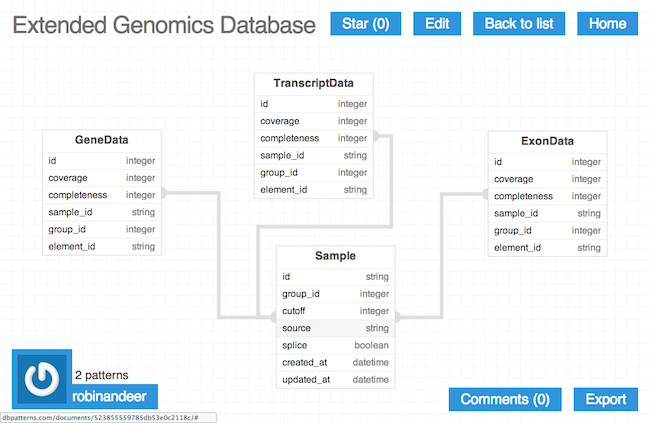

..  _sql:

SQL Structure
==============
The SQL structure in `Chanjo` is built on-top of the Elemental_ database. It basically sets up tables and relationships for genes, transcripts, and exons. `More details <elemental_db>`_ has been mocked up over at dbpatterns_.

The extensions introduced in `Chanjo` adds a number of tables that are nessesary for storing coverage information and, since v0.4.0, a separate entry per sample to keep track of various meta-data. `Full details <extended_db>`_ again has been mocked up at dbpatterns_.

Coverage Data Tables
---------------------
Coverage data tables come in 3 flavors, one for each genetic element type. Each of the entries is connected with a single element and describes both the average coverage across as well as the completeness for the exonic regions.

It's obviously also connected to a single sample ID which together with the element ID make up the `primary key`.

Sample (Meta) Data Table
-------------------------
The sample table is the latest addition to the SQL structure. It's a neat complement for consolidating all important information about the coverage analysis. Before you needed to keep track of e.g. the cutoff used for completeness yourself. Now this is linked to each sample directly in the SQLite database.

Included columns:

* ``cutoff``: Cutoff used for calculating completeness
* ``splice``: Whether or not splice sites were included in the analysis
* ``source``: Path to the BAM file used to extract coverage from
* ``created_at``: Date when the analysis was run
* ``updated_at``: Date of the last update to the entry

.. _dbpatterns: http://dbpatterns.com/
.. _Elemental: http://elemental.readthedocs.org/en/latest/
.. _elemental_db: http://dbpatterns.com/documents/5232fea69785db1b448e354c/
.. _extended_db: http://dbpatterns.com/documents/523855559785db53e0c2118c/